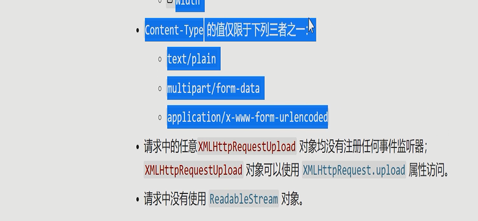

GET /foo/bar HTTP/1.1
====
HTTP/1.1 200 OK
Last-Modified: 3/12

content
====
GET /foo/bar HTTP/1.1
User-Agent: xxxx
Referer: xxxxyyy
If-Modified-Since: 3/12
====
HTTP/1.1 304 Not Modified


GET /foo/bar HTTP/1.1
====
HTTP/1.1 200 OK
ETag: ReFtI76T5

content
====
GET /foo/bar HTTP/1.1
User-Agent: xxxx
Referer: xxxxyyy
If-None-Match: ReFtI76T5
====
HTTP/1.1 304 Not Modified


304协商缓存

强缓存
使用日期之前本地的缓存
Expires未来时间
age从现在到未来的一段时间
一般用：
cache-control:max-age=1513453 可以不缓存
public 表明响应可以被任何对象（代理服务器，请求客户端）缓存（没有max-age指令或Expires消息头）
private 表明响应只能被单个用户缓存，不能被代理服务器缓存。可以缓存相应内容
no-cache 在发布缓存副本时，强制要求缓存把请求提交给原始服务器进行验证
no-store 缓存不应存储有关客户端请求或服务器响应的任何内容
用来控制各种缓存

GET /a.png HTTP/1.1
=================
HTTP/1.1 200 OK 
Date:
Content-Type:
Expires:12/5
PNG Image


401 未授权 UnAuthorized
403  Forbidden隐藏
404 未找到 not found
301 move Permanently
302  moved Temporarily
501 Not implemented请求的方法不被服务器支持
502 Internal Server Error

前端跳转：返回的页面根据条件通过js来跳转
HTTP跳转：用301/302+LOcation头来跳转
跳转对XHR是透明的

http跳转一般是使用请求头里的User-Agent头
GET /HTTP/1.1
Host: taobao.com:8080
User-Agent: Chrome 
=======
HTTP/1.1 200 OK
```JS
    <script>
      var ua = navigator.userAgent
      if(ua.....) {
        location.href = 'https://h5.m.taobao.com/'
      }
    </script>
```
==========


cors:跨域请求
Access-Control-Allow-Origin

Cross-site request forgery跨站请求伪造
CSRF
防范：1.Referer 2.增加字段key csrf-Token令牌

```js
OPTIONS /aaa.json HTTP/1.1
Referer: https:// ......
Host: www.xxxx.com
=========
HTTP/1.1 200 OK
Access-Control-Allow-Origin:*
Access-Control-Max-Age:86400
Access-Control-Max-Methods:GET, POST, SEARCH
Access-Control-Max-Headers:X-CSRF-TOKEN, xxxx
=========
GET /aaa.json HTTP/1.1
Referer: https://......
Host:  www.xxx.com
===============
HTTP/1.1 200 OK
Access-Control-Allow-Origin:*

aaa.json
```
预检请求



=========
remote procedure calls RPC远程过程调用

jsonrpc
======
PUT /users/larry HTTP/1.1//以资源为中心 RESTful
...

{
  name:'larry',
  age:28,
  xxx:xxx,
}

DELETE /users/larry HTTP/1.1
====
POST /rpc HTTP/1.1
..

{
  method:'addUser',
  params:['larry', 28, xxx, ]
}


POST /rpc HTTP/1.1
..

{
  method:'deleteUser',
  params:['larry']
}


内容协商
req:
'GET' / HTTP/1.1
accept: text/html, application/xhtml+xml, image/webp//媒体类型
Accept-Encoding: deflate, gzip, br
accept-language:zh-CN; q=0.8，//优先级
res:
HTTP/1.1 200 OK
content-encoding: gizp
content-language:zh-CN