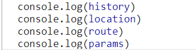
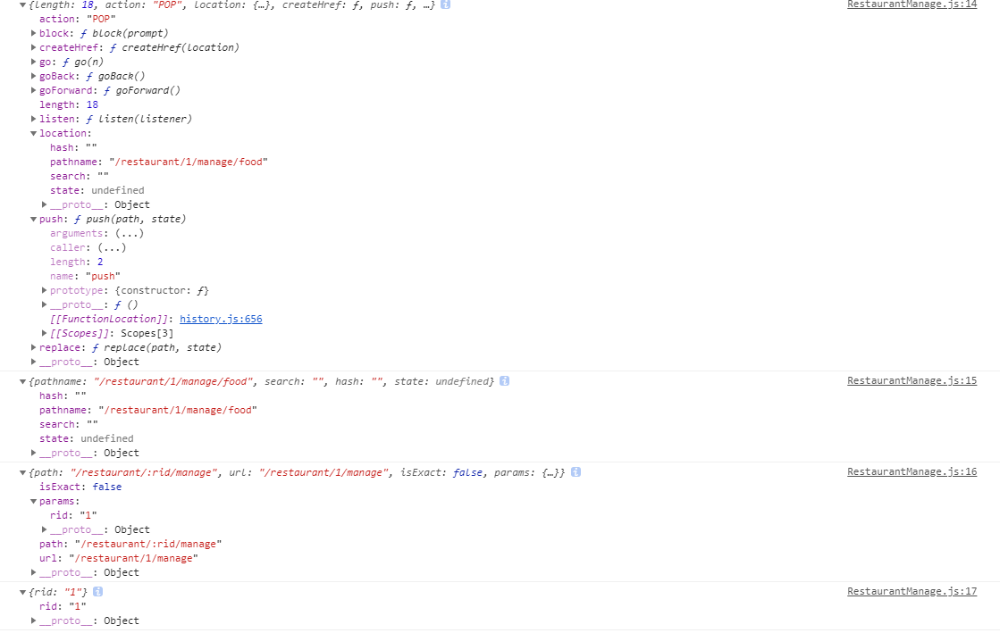
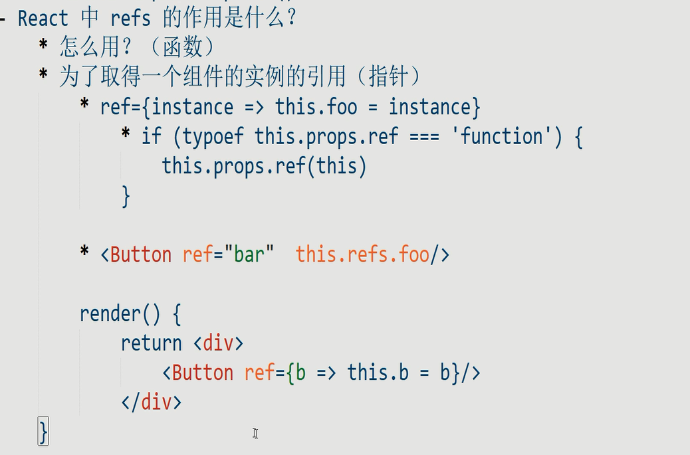

create-react-app

```js
npm install -g create-react-app
create-react-app hello-react
cd hello-react
npm start
```

---

引入React和React.js的组件父类

```js
import React, { Component } from 'react'
import ReactDOM from 'react-dom'
class Header extends Component {
  constructor
  render () {
    return (//jsx
      <div>
        <h1>React 小书</h1>
      </div>
    )
  }
}
ReactDOM.render(
  <Header />,
  document.getElementById('root')
)
```

ReactDOM把React组件渲染到页面上,ReactDOM是为了复用，可以渲染到其他平台如canvas


1. JSX 是 JavaScript 语言的一种语法扩展，长得像 HTML，但并不是 HTML。
2. React.js 可以用 JSX 来描述你的组件长什么样的。
3. JSX 在编译的时候会变成相应的 JavaScript 对象描述。
4. `react-dom` 负责把这个用来描述 UI 信息的 JavaScript 对象变成 DOM 元素，并且渲染到页面上。

---

### render

`render` 方法必须要返回一个 JSX 元素。但这里要注意的是，必须要用一个外层的 JSX 元素把所有内容包裹起来。返回并列多个 JSX 元素是不合法的。

React.js 封装了不同类型的事件,官网文档参考： [SyntheticEvent - React](https://facebook.github.io/react/docs/events.html#supported-events)

没有经过特殊处理的话，*这些 on\* 的事件监听只能用在普通的 HTML 的标签上，而不能用在组件标签上*。

 默认配置 defaultProps

```js
 static defaultProps = {

}
```


# webpack

 打包

将除js以外的其它资源也当成可以require的资源
  如 图片，css，json，svg，字体，
  它通过把这些非js资源转换为等价的js文件来实现。
  这些转换工具在webpack里被称为loader
    即使是js文件，也会经过babel-loader转换

plugin在webpack则是对整体的打包结果进行处理的一种插件机制
  如压缩，混淆，（webpack-jsuglify-plugin）
  处理通用（vendor）模块的抽离（common-chunks-plugin）
  自动生成入门html页面（webpack-html-plugin）

代码分割 code spliting
  将一开始不需要用到的模块打包到另一个或多个文件中，在需要的时候（代码执行到对应的位置时）再加载

摇树优化 tree shaking
  不需要用到的代码将不会进入到打包结果中，减少打包体积
  此功能主要依赖es module语法，因为它提供静态分析（即不运行代码对代码进行分析）的可能性

---

Router







